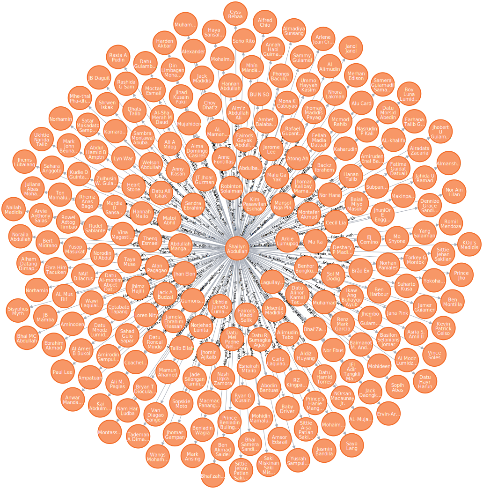
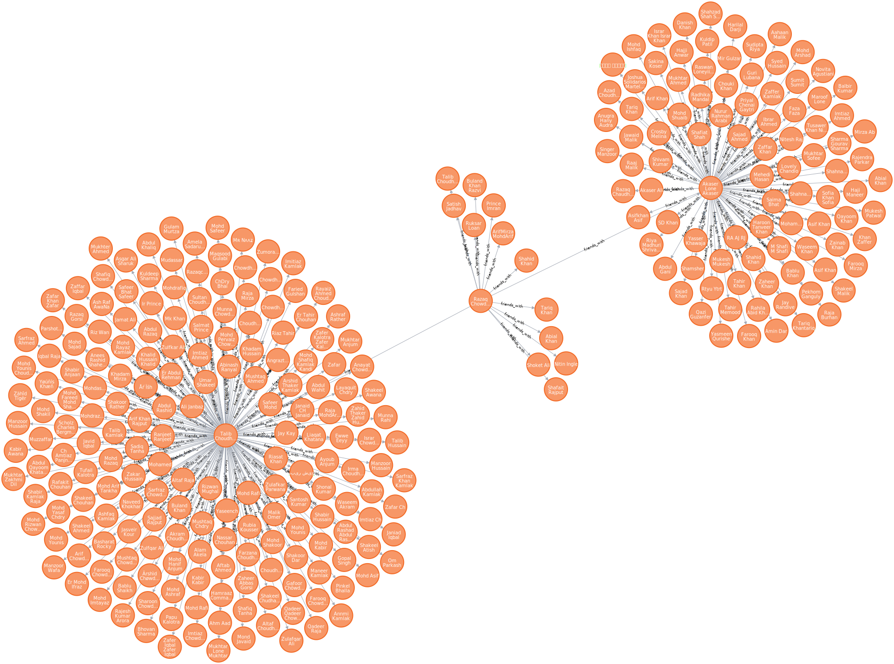

# Facebook Scraper

This tool scrapes Facebook account information and then stores the scraped data into a Neo4j database.

Currently, images from profiles are not scraped with the exception of the profile picture. A CDN link is obtained for
profile pictures.

## How to run

Use the following command to install the dependencies of this program

```shell
pip install -r requirements.txt
```

Then, start the program using

```shell
python main.py
```

Please see the parameters section to see how to customize this program. It is recommended that you use a VPN while
running this script in order to avoid IP bans. Finally, you must have an instance of Neo4j database running for which
you have provided DATABASE_URL. The program has been tested with Neo4j 4.2.5.

## Cookies

It is to be noted that a cookies file must be provided for scraping to occur. The cookies can be obtained using a tool
such a [EditThisCookie](https://chrome.google.com/webstore/detail/editthiscookie/fngmhnnpilhplaeedifhccceomclgfbg?hl=en)
plugin for Chrome. You must paste the obtained cookies from a successful Facebook login attempt into the *cookies.json*
file. A default cookies.json is provided, but no guarantee is given about the validity of the cookies.

## Parameters

The parameters of program can be configured in the *config.py* file. The various paramets are

1. **DATABASE_URL**: The program uses the connection string provided in this parameter to connect to a Neo4j database.
2. **ROOT_NAME**: Is the starting profile for the scraper to scrape from. Can be ID or link name such as
   razaq.chowdhary.1238.

3. **DEPTH**: The distance from the starting node the scraper will scrape nodes to. For example with DEPTH 2, the
   scraper will scrape the root node, then the friends of the root node and then the friends of the friends. This is an
   experimental feature, please set DEPTH to 0 to scrape a single account. Otherwise Facebook will hand out temporary
   bans.

4. **COOKIE_FILE**: Path to cookie file.
5. **SLEEP_INTERVAL**: The scraper will wait between SLEEP_INTERVAL[0] and SLEEP_INTERVAL[1] seconds before scraping the
   next node. This is done to avoid bans.

## Images/Visualization

The following is a visualization obtained from Neo4j desktop. The first image shows a single account scraped and the
second shows depth = 1 scraping.




